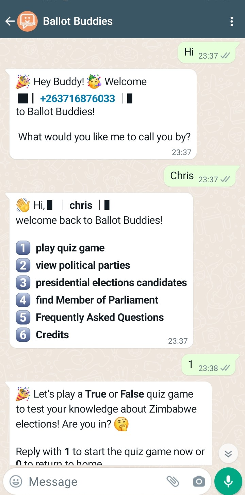
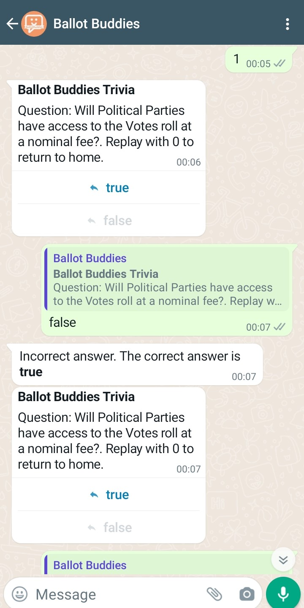
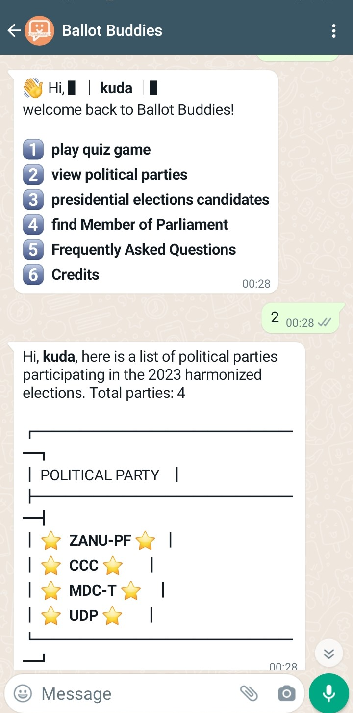

<p align="center">
  <a href="#key-features">Key Features</a> &nbsp; | &nbsp;
  <a href="#branches">Branches</a> &nbsp; | &nbsp;
  <a href="#getting-started">Getting Started</a> 
</p>
<h2 align="center">
  </br>Ballot Buddies
  </br>
</h2>
Our chatbot is designed to provide you with quick and easy access to 
a wide range of information related to elections, including voter 
registration, polling locations,elections candidates, elections education (trivia/quiz)
and voting deadlines.
<p align="center">
   &nbsp; | &nbsp;
   &nbsp; | &nbsp;
   &nbsp; | &nbsp;
</p>

## Key Features 
- Tech Stack  `Python`  `Django`  `Html\CSS` `PostgreSQL` `Redis`
- Tracking `Jira`
- Docs `Confluence` `Notion`
- Clould services  
  - Virtual Machine `Google cloud`  
  - Email services  `AWS simple notification services`
  - Whatsapp 3rd party api `Twilio`

## Branches
- **DIT**		  : Development branch
- **Main**        : Code for specified release

## Getting Started
1. Clone development branch :
    ```bash
    # Clone repository
    $ git  clone https://github.com/kudah99/WABOT.git
    # Verify WABOT is cloned
    $ ls 
    ...
    WA-BOT
    ```